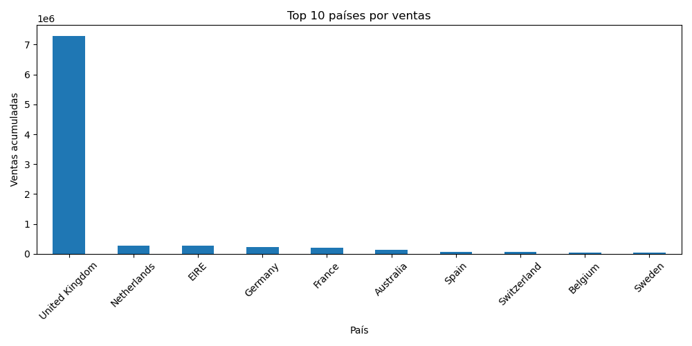
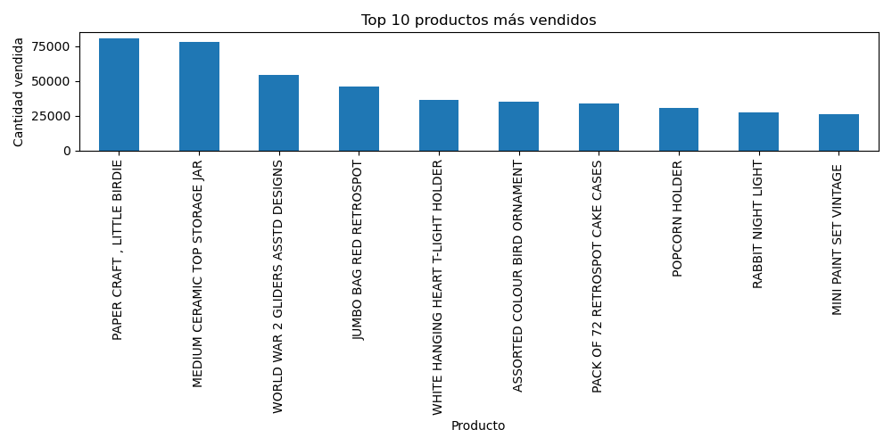
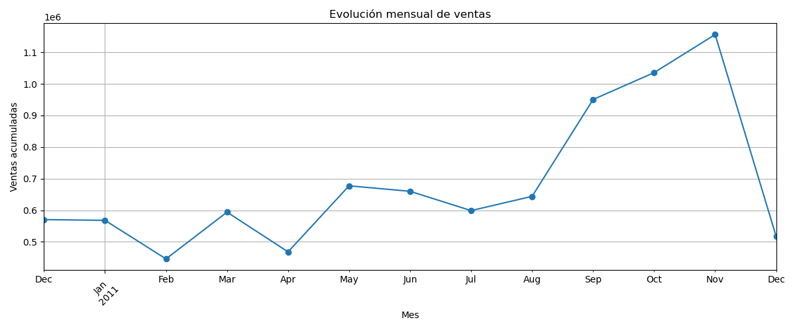

# Taller 01 - Adquisición, procesamiento y visualización de datos

## Maestría en Ciencia de Datos

Análisis exploratorio del conjunto de datos **Online Retail** utilizando Python, Pandas, SQLite y herramientas de visualización.

---
## Descripción del proyecto

Este proyecto tiene como finalidad realizar un proceso completo de análisis de datos sobre el conjunto de información comercial **Online Retail**.

Se desarrolló un flujo de trabajo que incluye la adquisición del dataset, exploración inicial, limpieza y transformación de datos, almacenamiento en una base de datos SQLite, análisis exploratorio y generación de visualizaciones para interpretar el comportamiento de las ventas.

El análisis busca obtener información relevante sobre:

- comportamiento de clientes;
- productos con mayor demanda;
- distribución geográfica de ventas;
- evolución temporal de los ingresos.

El desarrollo fue realizado utilizando Python y librerías orientadas al análisis de datos como Pandas, NumPy y Matplotlib.
---

## Objetivos del proyecto

### Objetivo general

Realizar un análisis exploratorio de datos sobre un conjunto de transacciones comerciales, aplicando técnicas de adquisición, limpieza, almacenamiento y visualización de información para identificar patrones relevantes del comportamiento de ventas.

### Objetivos específicos

- Adquirir y cargar el dataset Online Retail utilizando herramientas de Python.
- Realizar un proceso de limpieza y preparación de datos para mejorar su calidad.
- Crear una estructura de almacenamiento mediante una base de datos SQLite.
- Analizar las principales características del conjunto de datos mediante técnicas de exploración estadística.
- Generar visualizaciones que permitan interpretar el comportamiento comercial del dataset.
---

## Dataset utilizado

### Online Retail Dataset

El conjunto de datos utilizado corresponde al dataset **Online Retail**, el cual contiene información de transacciones comerciales realizadas durante el periodo comprendido entre diciembre de 2010 y diciembre de 2011.

Cada registro representa una línea de detalle de una transacción de venta e incluye información relacionada con productos, clientes, fechas, cantidades y países.

### Variables principales

| Variable | Descripción |
|---|---|
| InvoiceNo | Número de factura o identificador de la transacción |
| StockCode | Código del producto vendido |
| Description | Descripción del artículo comercializado |
| Quantity | Cantidad de unidades adquiridas |
| InvoiceDate | Fecha y hora de la transacción |
| UnitPrice | Precio unitario del producto |
| CustomerID | Identificador del cliente |
| Country | País asociado al cliente |

### Características iniciales del dataset

Antes del proceso de limpieza, el conjunto de datos contenía:

- **541.909 registros**
- **8 variables**

Posteriormente se aplicaron procesos de limpieza y transformación para obtener un conjunto de datos preparado para el análisis.
---

## Herramientas utilizadas

El desarrollo del proyecto fue realizado utilizando herramientas orientadas al procesamiento, análisis y visualización de datos.

| Herramienta | Aplicación |
|---|---|
| Python | Lenguaje utilizado para la adquisición, procesamiento y análisis de datos |
| Pandas | Manipulación, limpieza y transformación del conjunto de datos |
| NumPy | Operaciones numéricas y procesamiento de información |
| Matplotlib | Generación de visualizaciones estadísticas |
| Seaborn | Apoyo en la creación de gráficos para análisis exploratorio |
| SQLite | Almacenamiento estructurado de los datos procesados |
| Jupyter Notebook | Entorno utilizado para desarrollar y documentar el análisis |
---

## Metodología aplicada

El proyecto siguió un flujo de trabajo basado en las etapas principales de un proceso de análisis de datos:

### 1. Adquisición de datos

Se realizó la carga del dataset **Online Retail** desde un archivo Excel utilizando la librería Pandas de Python.

### 2. Exploración inicial

Se efectuó una revisión preliminar del conjunto de datos mediante:

- cantidad de registros y variables;
- nombres de columnas;
- tipos de datos;
- identificación de valores faltantes;
- análisis estadístico descriptivo.

### 3. Limpieza y preparación de datos

Se aplicaron procesos de limpieza para mejorar la calidad de la información:

- tratamiento de valores nulos;
- eliminación de registros duplicados;
- eliminación de valores inconsistentes;
- revisión de cantidades y precios inválidos.

### 4. Transformación de datos

Se creó una nueva variable denominada:

TotalAmount

calculada mediante:

TotalAmount = Quantity × UnitPrice

Esta variable representa el valor económico total generado por cada transacción y permitió realizar análisis posteriores relacionados con los ingresos y comportamiento de ventas.

---


## Limpieza de datos

El dataset original contenía:

- **541.909 registros**
- **8 variables**

Antes de realizar el análisis exploratorio se aplicaron diferentes procesos de limpieza para mejorar la calidad y consistencia de la información.

### Tratamiento de valores faltantes

Se identificaron valores nulos en las variables:

- `Description`: 1.454 registros sin descripción del producto.
- `CustomerID`: 135.080 registros sin identificación del cliente.

Decisión aplicada:

- Se eliminaron los registros sin descripción debido a que no permitían identificar correctamente los productos vendidos.
- Se eliminaron los registros sin CustomerID porque impedían asociar las transacciones con clientes específicos.

### Eliminación de registros duplicados

Se detectaron:

- **5.225 registros duplicados**

Estos registros fueron eliminados para evitar que las transacciones repetidas alteraran los resultados del análisis.

### Tratamiento de valores inconsistentes

Se revisaron valores inválidos en las variables numéricas:

- Registros con `Quantity` menor o igual a cero.
- Registros con `UnitPrice` menor o igual a cero.

Se eliminaron:

- **8.872 registros con cantidades negativas**
- **40 registros con precios inválidos**

### Resultado final de la limpieza

Después de aplicar todos los procesos de depuración, el dataset final quedó conformado por:

- **392.692 registros**
- **8 variables originales**
- **1 variable adicional creada: TotalAmount**
---

## Almacenamiento en SQLite

Después del proceso de limpieza y transformación, los datos fueron almacenados en una base de datos SQLite para facilitar su gestión, consulta y análisis posterior.

### Base de datos generada

Archivo creado:

online_retail.db

### Tabla almacenada

Dentro de la base de datos se creó la tabla:

ventas

La tabla contiene los registros procesados junto con la variable calculada:

TotalAmount

Los datos fueron posteriormente consultados nuevamente desde Python utilizando Pandas para continuar con el análisis exploratorio.
---

## Análisis Exploratorio de Datos (EDA)

Después del proceso de limpieza, se realizó un análisis exploratorio para comprender las principales características del conjunto de datos y obtener indicadores generales del comportamiento comercial.

### Indicadores generales obtenidos

| Indicador | Resultado |
|---|---:|
| Registros analizados | 392.692 |
| Clientes únicos | 4.338 |
| Productos diferentes | 3.877 |
| Países registrados | 37 |
| Periodo analizado | 01/12/2010 - 09/12/2011 |
| Ventas acumuladas | 8.887.208,89 |

### Descripción del análisis

El conjunto de datos contiene información sobre transacciones comerciales realizadas durante aproximadamente un año. Cada registro representa una línea de detalle de una venta, permitiendo analizar aspectos relacionados con productos, clientes, países y comportamiento temporal.

A partir del análisis exploratorio se identificaron los siguientes elementos:

- La información contiene transacciones realizadas por miles de clientes.
- Existe una variedad amplia de productos comercializados.
- Las ventas presentan una distribución internacional con presencia en varios países.
- El comportamiento de las ventas presenta variaciones a lo largo del periodo analizado.

### Variables analizadas

Durante el EDA se analizaron principalmente:

- `Quantity`: cantidad de unidades vendidas.
- `UnitPrice`: precio unitario de los productos.
- `TotalAmount`: valor económico generado por cada transacción.
- `Country`: distribución geográfica de las ventas.
- `Description`: identificación de productos comercializados.
- `InvoiceDate`: evolución temporal de las ventas.
---

## Visualizaciones generadas

Para facilitar la interpretación del comportamiento del dataset se generaron tres visualizaciones principales utilizando Matplotlib.

---

## 1. Ventas por país

Archivo generado:

ventas_por_pais.png



### Interpretación

La visualización permite analizar la distribución geográfica de las ventas. Se observa una alta concentración del valor comercial en Reino Unido, seguido por otros mercados como Países Bajos, Irlanda, Alemania y Francia.

---

## 2. Productos más vendidos

Archivo generado:

productos_mas_vendidos.png



### Interpretación

El gráfico permite identificar los productos con mayor cantidad de unidades comercializadas. Entre los artículos con mayor volumen de ventas destacan:

- PAPER CRAFT, LITTLE BIRDIE.
- MEDIUM CERAMIC TOP STORAGE JAR.
- WORLD WAR 2 GLIDERS ASSTD DESIGNS.

Esta información permite reconocer productos con mayor rotación dentro del catálogo.

---

## 3. Evolución mensual de ventas

Archivo generado:

ventas_mensuales.png



### Interpretación

La gráfica muestra la evolución temporal de las ventas durante el periodo analizado. Se identifica un incremento importante hacia los últimos meses de 2011, alcanzando el mayor nivel de ventas en noviembre de 2011.

## Estructura del repositorio

La organización final del proyecto es la siguiente:

```text
Taller_Ciencia_Datos

│
├── Taller_01_Ciencia_Datos.ipynb
│   └── Notebook principal con el proceso completo de análisis.

├── Online Retail.xlsx
│   └── Dataset original utilizado para el análisis.

├── online_retail.db
│   └── Base de datos SQLite generada durante la ejecución del notebook.

├── descripcion_dataset.txt
│   └── Archivo con la descripción general y análisis del dataset.

├── ventas_por_pais.png
│   └── Visualización de ventas agrupadas por país.

├── productos_mas_vendidos.png
│   └── Visualización de productos con mayor cantidad vendida.

├── ventas_mensuales.png
│   └── Visualización de evolución temporal de ventas.
```markdown
└── README.md
    └── Documentación general del proyecto.

## Conclusiones

El desarrollo de este proyecto permitió aplicar un flujo completo de trabajo en ciencia de datos, desde la adquisición y preparación de información hasta la generación de conocimiento mediante técnicas de análisis exploratorio y visualización.

El proceso de limpieza permitió mejorar la calidad del dataset mediante la eliminación de registros incompletos, duplicados y valores inconsistentes, obteniendo una base preparada para el análisis.

El almacenamiento en SQLite facilitó la gestión de la información procesada y permitió realizar consultas estructuradas sobre los datos.

El análisis exploratorio permitió identificar características importantes del comportamiento comercial, como la cantidad de clientes, productos disponibles, distribución geográfica y evolución de las ventas.

Finalmente, las visualizaciones generadas facilitaron la interpretación de patrones relacionados con mercados principales, productos con mayor demanda y comportamiento temporal de los ingresos.